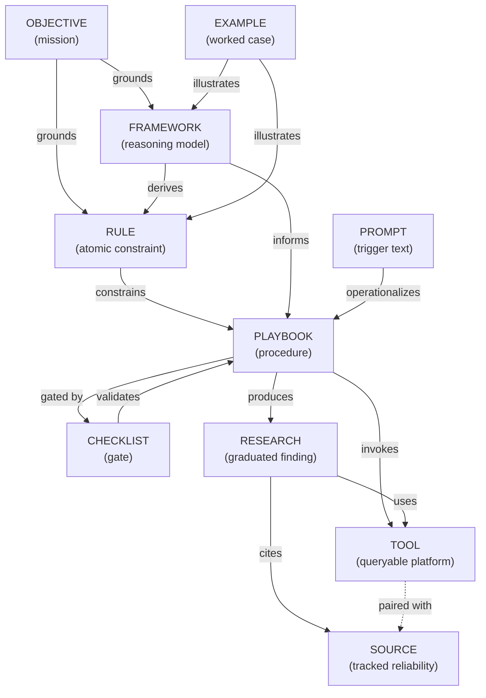

# Knowledge Architecture — AI Research Operating System

This document is the design record for treating this repository as **an AI agent's long-term knowledge base**, not documentation for a human to read start-to-finish. Every decision below is judged against one question: *does this make a piece of knowledge easier for a retriever to find, rank, and trust correctly?* See [MIGRATION.md](MIGRATION.md) for how the prior flat `docs/` structure was cut over into this one.

---

## 1. Knowledge Architecture

### The hierarchy

```
Foundational (why)          OBJECTIVE.md
                                  │
Philosophy & Standards      ┌─────┴─────┬─────────────┬─────────────┐
(what's true / required)   RULES    FRAMEWORKS    PLAYBOOKS    CHECKLISTS
                          (atomic)  (reasoning)  (procedure)   (gates)
                                  │
Reference (what's queryable)  ┌───┴────┬──────────┐
                             TOOLS   SOURCES    (nothing produces
                          (how to    (should I    these — they're
                           query)     trust it)    queried, not run)
                                  │
Output (what got produced)   RESEARCH
                                  │
Support (how to operate)    ┌─────┴─────┐
                         PROMPTS      EXAMPLES
                       (triggers)   (worked cases)
```

**Why nine categories and not fewer:** each one answers a different retrieval *intent*, and collapsing any two loses the ability to filter by intent before searching semantically (see §4). A Rule answers "is X required?" A Framework answers "how do I judge X?" A Playbook answers "what do I do, in order?" A Checklist answers "did I do all of it?" A Tool answers "how do I look this up?" A Source answers "has this specific origin been reliable?" Research answers "what did we conclude before?" An Example answers "show me this applied." A Prompt answers "give me the literal text to invoke this."

### Why each category exists

- **Rules** — atomic, boolean, non-negotiable. An agent can check one directly without judgment (e.g. "was the visual retrieved, not merely recommended?"). Separated from Frameworks because a Rule is a hard constraint on any object type, not a reasoning model in itself.
- **Frameworks** — multi-criteria reasoning systems that produce a classification or ranking (Evidence Tier, six-dimension EV score). This is where *judgment* lives, so it's the layer most worth retrieving in full before an agent makes a call.
- **Playbooks** — ordered procedures that invoke Rules and Frameworks in sequence. Separating sequence from judgment means the sequence can change (add a phase) without touching the reasoning models it calls.
- **Checklists** — finite, enumerable, machine-checkable item lists gating a transition. Structurally different from a Rule (one statement) because a Checklist's `items` are individually addressable data, not prose.
- **Tools** — named external platforms/APIs an agent queries live. Answers "how," not "should I trust."
- **Sources** — named, evidence-originating entities tracked for reliability over time. Answers "should I trust," not "how to query." (A named platform like Arkham can be both a Tool and a Source — see `/tools/README.md`.)
- **Research** — the actual output: graduated, finalized findings. This is the layer a retriever searches most often ("what have we found on X before"), and the only layer that grows without bound from normal operation.
- **Examples** — worked, illustrative applications of a Rule/Framework/Playbook. The best few-shot context for an agent that needs to *apply* a standard, not just read its definition.
- **Prompts** — thin, literal triggers for one Playbook phase. Never restate a standard, only invoke it by reference.

This is a **directed dependency structure**, not a strict pipeline — Research cites Sources and invokes Tools, but Rules and Frameworks don't depend on either; they're the fixed law Research must satisfy. See §5 for the full graph.

---

## 2. AI Retrieval Readiness

### Chunk boundaries

**One knowledge object = one file = one primary retrieval unit.** Two chunk levels:

1. **Summary chunk** — the frontmatter `summary` field. 1–3 sentences, self-contained (must make sense with zero surrounding context), no markdown syntax. This is what gets embedded and matched first; it's cheap to embed, cheap to compare, and small enough that a bad match is cheap too.
2. **Section chunks** — within the body, split on `##` headers. A Framework or Rule with several `##` sections (e.g. FRAMEWORK-001's "The Tiers" / "Source → Tier reference" / "Resolved ambiguous cases") gets one sub-chunk per section, so a query about one resolved edge case doesn't require embedding (or returning) the entire tier table.

**Why not embed the whole file as one chunk:** several existing objects (FRAMEWORK-001, FRAMEWORK-003) mix a canonical table, worked resolutions, and cross-references in one file — useful for a human reading top to bottom, wasteful for a vector match where only one section is relevant to a given query. Chunking at `##` boundaries preserves human readability while giving the retriever finer-grained hits.

### Document size

**Target: 150–800 words of body content per object** (excluding frontmatter). This is deliberately small:
- Below ~150 words, the object is probably a Rule or Prompt (already the smallest types) — fine.
- Above ~800 words, split it: either the object is doing the work of two objects (a Framework that's grown a Playbook's worth of procedure inside it — split it out), or it needs `##` section chunking to stay retrievable at the sub-document level (see above).
- **Hard ceiling: 1,500 words.** Past this, retrieval quality degrades because a single embedding has to represent too many distinct ideas. At the current scale every migrated object is under 700 words; this ceiling matters once Research and Source objects start accumulating real content at the target scale (§7).

### Metadata

Every object's YAML frontmatter is retrieval metadata, not decoration — see `/_schemas/_common.schema.yaml` for the full contract. The fields that matter most for retrieval specifically:

- `type` — the primary metadata filter (§4).
- `tags` — secondary filter; **controlled vocabulary**, not free text. A new tag is only added if it will plausibly be reused (check `MANIFEST.jsonl` for existing tags before inventing one) — otherwise tag sprawl makes metadata filtering useless at 10,000+ objects.
- `status` — `active` objects are the default retrieval set; `deprecated`/`superseded` are excluded unless an agent explicitly asks for history.
- `related` — explicit graph edges (§5), so retrieval can expand beyond the top-k vector hits to pull in a dependency that didn't score high enough on semantic similarity alone (e.g. a Playbook without pulling in the Rule it depends on).
- `source_of_truth` — lets a retriever prefer the canonical object over one that merely references the same concept, when both match a query.

### Naming conventions

**`<TYPE>-<zero-padded-id>-<slug>.md`** — e.g. `RULE-003-publication-standard.md`, `SOURCE-000042-glassnode.md`.

- The `id` in frontmatter (e.g. `RULE-003`) is the permanent primary key. The filename may be renamed for readability (the slug can change); the id never does. Every `related`/`depends_on`/`illustrates` field references the **id**, never the filename — this is why renaming a file is safe and renumbering an id is not.
- ID width is type-specific, sized to the type's expected scale at target volume (§7): Rules/Frameworks/Checklists = 3 digits (small, curated sets), Playbooks/Prompts = 4 digits (hundreds), Tools = 5 digits (thousands), Sources/Research = 6 digits (tens of thousands).
- IDs are assigned sequentially and never reused, including for deleted/superseded objects — a dangling reference to a retired id is a clear signal ("this was deprecated"), a reused id silently corrupts history.

### Cross-references

Two independent reference systems, serving different consumers:

1. **Markdown links in prose**, for human readers — e.g. `[Evidence Tier Framework](/frameworks/FRAMEWORK-001-evidence-tier-framework.md)`. Always **root-relative** (leading `/`), never `../../`-style relative paths — GitHub's renderer resolves a leading `/` against the repository root regardless of which file it's in, so a link written once is correct from any directory, and a script doing global path rewrites (see `/MIGRATION.md`) never has to compute per-file relative depth.
2. **Frontmatter `id` references**, for machines — `related`, `depends_on`, `enforced_by`, `illustrates`, `validates`, `cites`. These are what a knowledge-graph traversal or a retrieval-expansion step actually reads; prose links are for humans clicking around and are never parsed programmatically.

### Tags

Tags are a flat, controlled list — not a taxonomy of their own (that's what `type` + the graph is for). A tag exists to answer "give me everything about X regardless of type" (e.g. tag `evidence` currently spans a Rule, a Framework, and a Prompt). Before adding a new tag, check `MANIFEST.jsonl` for a close existing match.

### Versioning

Two independent version concepts, never conflated:
- **Object `version`** (frontmatter, integer) — increments on any meaningful content change to *that specific object*. Local, granular.
- **Repository release** (`CHANGELOG.md` + git tag, e.g. `v2.2.0`) — a coherent bundle of object changes shipped together. Global, infrequent.

An object is never silently edited in place once `status: active` and referenced elsewhere. Content changes bump `version`; a change that invalidates the *meaning* other objects rely on sets `status: deprecated`, points `superseded_by` at the new object, and the new object's `supersedes` points back — this is append-only history, which matters once thousands of Research/Source objects exist and something written a year ago needs to remain resolvable even if a Rule it relied on has since changed.

---

## 3. Knowledge Objects

Full JSON-Schema-style contracts live in [`/_schemas/`](/_schemas); this section explains what each field is *for*. Every object shares the base contract in [`_common.schema.yaml`](/_schemas/_common.schema.yaml) (`id`, `type`, `title`, `status`, `version`, `tags`, `related`, `summary`, `source_of_truth`, plus optional `created`/`updated`/`supersedes`/`superseded_by`).

| Type | Required fields (beyond common) | Relationships | Example |
|---|---|---|---|
| **Rule** | `statement`, `applies_to` | `enforced_by` → workflow(s) | [RULE-003](/rules/RULE-003-publication-standard.md) — Publication Standard |
| **Framework** | `owns`, `criteria` | referenced by Rules/Playbooks it grounds | [FRAMEWORK-001](/frameworks/FRAMEWORK-001-evidence-tier-framework.md) — Evidence Tiers |
| **Playbook** | `phases`, `produces` | `depends_on` → Rules/Frameworks | [PLAYBOOK-0002](/playbooks/PLAYBOOK-0002-daily-workflow.md) — Daily Workflow |
| **Checklist** | `items`, `validates`, `machine_checkable` | `validates` → Playbook/Rule; `enforced_by` → workflow | [CHECKLIST-001](/checklists/CHECKLIST-001-qa-gate.md) — QA Gate |
| **Tool** | `category`, `url`, `access`, `reliability_tier` | may pair with a Source (`tool_ref` on the Source side) | [TOOL-00001](/tools/00/TOOL-00001-arkham-intelligence.md) — Arkham |
| **Source** | `outlet`, `source_type`, `default_tier`, `last_reviewed` | `tool_ref` → Tool; cited by Research | [SOURCE-000001](/sources/000001/SOURCE-000001-arkham-intelligence.md) |
| **Research** | `topic`, `evidence_tier`, `publication_status`, `decision_scores`, `origin_issue` | `sources_cited` → Source[]; `tools_used` → Tool[] | *(none graduated yet — see §8)* |
| **Example** | `illustrates` | points at Rule/Framework/Playbook | [EXAMPLE-00001](/examples/EXAMPLE-00001-weakest-link-rule.md) |
| **Prompt** | `used_in_phase` | points at a Playbook phase | [PROMPT-0001](/prompts/PROMPT-0001-market-scan.md) — Market Scan |

**Relationship field naming convention** (so an agent doesn't have to guess which field to read): `related` is always the generic catch-all edge list; every typed relationship (`depends_on`, `enforced_by`, `illustrates`, `validates`, `cites`/`sources_cited`, `tool_ref`, `supersedes`) names the *semantic direction* of the edge, not just "this is relevant." A generic-only graph is nearly as useless as no graph at metadata-filtering scale.

---

## 4. Retrieval Strategy

```
                         ┌─────────────────────┐
        agent query ───► │ 1. Metadata filter   │  type=?, tags=?, status=active
                         └──────────┬──────────┘
                                    ▼
                         ┌─────────────────────┐
                         │ 2. Semantic search   │  cosine similarity over
                         │   (within filtered   │  summary + section chunks
                         │    set)              │
                         └──────────┬──────────┘
                                    ▼
                         ┌─────────────────────┐
                         │ 3. Ranking           │  similarity × type-priority
                         │                      │  × evidence-tier weight
                         │                      │  × recency × source_of_truth
                         └──────────┬──────────┘
                                    ▼
                         ┌─────────────────────┐
                         │ 4. Graph expansion   │  pull in 1-hop `related`/
                         │   (related docs)     │  `depends_on` even if they
                         │                      │  didn't score in top-k
                         └──────────┬──────────┘
                                    ▼
                              results returned
```

1. **Metadata filtering first, semantic search second.** A query like "what's the rule about visual evidence" should filter `type: rule` (or `type: rule OR checklist`) before ever computing an embedding comparison — this is both cheaper and more precise than semantic-searching the entire corpus and hoping type-relevant results float to the top. `status: active` is always applied unless the query explicitly asks for history.

2. **Semantic search** runs within the filtered set, over both the `summary` chunk (cheap, high-precision) and body section chunks (broader recall). A two-stage retrieve — summary match first, only opening body chunks for objects whose summary already scored above a threshold — keeps the vector index dominated by cheap chunks at scale.

3. **Ranking** is not similarity alone. Composite score:
   - **Type priority** — for a query implying "what must I follow," a Rule/Checklist should outrank a Research object even at equal similarity, since Research is a past *application* of the rule, not the rule itself.
   - **Evidence priority** — for Research and Source objects specifically, a Tier 1–2 object should outrank a Tier 5–6 object at equal semantic similarity, mirroring [Evidence Tier Framework](/frameworks/FRAMEWORK-001-evidence-tier-framework.md)'s own logic; retrieval ranking should never contradict the evidence system the framework itself enforces.
   - **Recency** — relevant mainly for Research and Source track records, irrelevant for Rules/Frameworks (a Rule doesn't get more or less true with age; the exception is `updated` on a `deprecated` object, which recency ranking should push *down*, not up).
   - **`source_of_truth: true`** — a tiebreaker boost, so the canonical Framework outranks a Playbook that merely references it, when both match.

4. **Related-document expansion** — after top-k, do one hop along `related`/`depends_on`/`enforced_by` edges and include anything not already in the result set. This is what prevents an agent from retrieving PLAYBOOK-0002 without also surfacing CHECKLIST-001 (its QA gate) even if the checklist's own text didn't score highly on the literal query.

5. **Evidence priority in retrieval vs. in content** — worth stating explicitly: the *ranking* system above uses evidence tier as one input among several. It must never be confused with the *publication* system in [RULE-003](/rules/RULE-003-publication-standard.md), where the weakest link — not a weighted average — determines the outcome. Retrieval ranks by blended relevance; publication gates by the single worst link. Keeping these conceptually distinct prevents a well-ranked (but tier-mixed) retrieval result from being mistaken for a publishable claim.

---

## 5. Knowledge Graph



**How references work, concretely:**

- **Rule ← Framework**: a Rule may be a distilled, checkable consequence of a Framework (e.g. RULE-002's four visual tiers are a direct restatement of FRAMEWORK-001's tiers for one specific artifact type). The Rule's `related` points at the Framework it derives from; the Framework does not need to enumerate every Rule derived from it (that would need updating every time a new Rule is added) — this is a one-directional pointer by design, discoverable in reverse via `MANIFEST.jsonl` if needed.
- **Playbook → Rule/Framework**: `depends_on` lists every Rule/Framework a Playbook's phases invoke. This is the edge an agent executing a Playbook follows to load the actual standard it must apply at each phase, rather than guessing from prose.
- **Playbook ↔ Checklist**: bidirectional by convention — the Checklist's `validates` names the Playbook it gates, and (once wired) the Playbook could add `gated_by` — currently the QA Gate is universal enough (gates all Research regardless of Playbook) that a single fixed edge suffices; this would need to become an explicit per-Playbook field only if multiple distinct checklists exist for different Playbooks.
- **Playbook → Tool**: not currently a typed field on Playbook objects (the existing two Playbooks reference Tools only in prose, via the Frameworks they invoke) — noted as a gap; see §8's migration backlog.
- **Research → Source / Tool**: `sources_cited` and `tools_used` are the two edges that make a Research object auditable — "what did this claim rely on" is answerable by graph traversal, not by re-reading prose.
- **Tool ↔ Source**: a *loose*, optional pairing (`tool_ref` on the Source side only) — not every Tool has a corresponding Source (e.g. a pure block explorer's reliability isn't really "tracked," it's just Tier 1 by construction), and not every Source is a live-queryable Tool (an anonymous tip has no API).
- **Example → Rule/Framework/Playbook**: one-directional (`illustrates`); an Example is retrieval context *for* the thing it illustrates, so the thing it illustrates doesn't need to know about every example of itself.
- **Prompt → Playbook**: `used_in_phase` names the phase by string (not a strict id reference, since phases are sub-parts of a Playbook object, not separate objects) — a deliberate exception to "always reference by id," justified because a phase has no independent existence outside its parent Playbook.

---

## 6. Future AI Integration

The structure above is designed so each of the following can be added **without changing the folder layout, naming convention, or schemas** — only by adding new, additive tooling that reads what's already here:

- **Vector Database / Embeddings** — index `summary` + `##`-chunked body per object, keyed by `id` (not filename) as the vector-DB record id, with `type`/`tags`/`status` as metadata payload for pre-filtering. Nothing in the repository needs to change; embedding is a read-only batch job over existing files, re-run whenever `MANIFEST.jsonl` shows new/changed objects (its `version` field is the dirty-check).
- **RAG** — the retrieval strategy in §4 *is* the RAG retrieval stage; a generation step just needs to be wired on top. Because every object is already short, self-contained, and typed, RAG context assembly can be as simple as "top-k after graph expansion, concatenated with their `id` as a citation key."
- **AI Agents** — a Playbook is already an agent-executable task spec (`phases`, `depends_on`, `produces`); an agent runtime just needs to walk `phases` in order, resolving each `depends_on` id via the vector DB or a direct file read. This repository was designed so an agent's context-loading step and a human's "what do I read next" step are the same traversal.
- **MCP tools** — each Tool object's (currently reserved, unused) `mcp_endpoint` field is exactly where a future MCP server/tool binding gets recorded once a Tool is wired for live agent queries (e.g. TOOL-00004/Etherscan → an MCP server that resolves transaction hashes). Adding this later is a one-field fill-in per Tool object, not a schema change.
- **GitHub API** — already the operating layer today (Issues, Projects, labels, Actions); §8 covers the one piece not yet wired — automated graduation of a finished `type:research` Issue into a static `/research/RESEARCH-######-*.md` object. Everything else (reading Issues, filtering by label, following `origin_issue` back from a Research object) already works via the standard GitHub REST/GraphQL API with no repository changes.

**Why "no structural change" is achievable:** every integration above is a *consumer* of the object/metadata/id contracts already defined in `/_schemas/`, never a *producer* that would require new fields on existing objects. The one deliberately reserved field (`mcp_endpoint`) exists precisely so that becomes true for MCP as well, rather than requiring a schema migration later.

---

## 7. Repository Scalability

Target: **5,000 Research, 2,000 Tools, 10,000 Sources, hundreds of Playbooks.** Rules/Frameworks/Checklists stay small by definition (they're canonical law, not accumulating output) and need no scaling treatment.

### Sharding

A flat folder with 10,000 files is unusable for both humans (`ls`) and some tooling (directory listing performance, git status). Shard by **ID-range folders**, sized to the type's target volume:

```
sources/
├── 000001/   ← SOURCE-000001 .. SOURCE-000999
├── 001000/   ← SOURCE-001000 .. SOURCE-001999
├── 002000/   ...
└── 009000/   ← up to SOURCE-009999

research/
├── 000001/   ← RESEARCH-000001 .. RESEARCH-000999
└── ...       ← 5 shards to cover 5,000

tools/
├── 00/       ← TOOL-00000 .. TOOL-00999   (2-digit ID-prefix shard, since 2,000 fits in 3 shards)
├── 01/
└── ...

playbooks/     ← no sharding: "hundreds" fits comfortably in one flat folder
prompts/       ← no sharding: same reasoning
rules/, frameworks/, checklists/   ← no sharding: these stay small permanently
```

This repository seeds `sources/000001/` and `tools/00/` now (see the four seed Tool objects and one seed Source object) specifically so the sharding convention is established *before* volume arrives, not retrofitted under pressure at object #1,000.

### Why not one file per Research per day, unbounded

At 5,000 Research objects, per-shard folders of ~1,000 keep any single directory listing fast and keep git diffs (for the Validate/Changelog workflows) scoped. The alternative — one giant `research.jsonl` — would break the "one object = one embeddable, individually-versioned file" principle in §2, so it's rejected even though it would technically scale fine for a database. This repository is optimized for **retrieval and per-object versioning**, not for query throughput a database engine would otherwise provide.

### MANIFEST.jsonl as the bootstrap index

At 17,000+ total objects, no agent should have to walk the filesystem to know what exists. [`MANIFEST.jsonl`](MANIFEST.jsonl) is a flat, append-friendly index — one JSON line per object (`id`, `type`, `title`, `status`, `version`, `tags`, `related`, `path`, `source_of_truth`) — regenerable from the frontmatter of every object in seconds, and small enough (a few MB even at 17,000 rows) to load wholesale before any vector search runs, giving §4's metadata-filter stage something to filter *without* touching the vector index at all for pure-metadata queries ("list every Tool tagged on-chain-analytics").

### Archival, not deletion

At scale, `deprecated`/`superseded` objects (§2 versioning) should not sit forever in the same shard as active ones once a shard is dominated by dead weight. Recommended (not yet implemented — see §8): a periodic job moves `status: deprecated` objects older than N versions into a parallel `_archive/<type>/` tree, mirroring the same shard structure, with `MANIFEST.jsonl` retaining a pointer either way — so history is never lost, but the "live" shards stay lean for retrieval.

---

## 8. Migration Plan

See [`MIGRATION.md`](MIGRATION.md) for the literal old-path → new-path mapping and the cutover this repository already performed. This section covers what's *left* — the gap between "the structure exists" and "the structure is fully self-operating":

1. **Done in this pass:** all 11 former `docs/*.md` files reclassified into Rules/Frameworks/Playbooks/Checklists with schema-conformant frontmatter; `prompt-library.md` split into 7 individual Prompt objects; seed Tool/Source/Example objects created to establish the pattern and sharding convention; `MANIFEST.jsonl` generated; every internal cross-reference repository-wide rewritten to root-relative paths; the two path-triggered GitHub Actions (Changelog Automation, Validate) repointed at the new folders.
2. **Not yet done, and out of scope for this pass:** automated **Research graduation** — a workflow that, on an Issue's `status:PASS*` label being confirmed by QA Gate Enforcement, generates a `/research/RESEARCH-######-*.md` object from the Issue's structured fields (mirroring how `changelog-automation.yml` already turns a file diff into an Issue, just in reverse — Issue into a file). This is deliberately not built in this pass because it's a *new* workflow, and the immediately preceding instruction for this repository was explicitly not to add more workflows/automation without strong justification; it's recorded here as the one piece of automation that would make the knowledge-layer redesign fully self-sustaining rather than requiring a manual export step.
3. **Not yet done:** the archival job described in §7, and wiring any real `mcp_endpoint` value on a Tool object (both require external systems this repository can describe but not itself run).

No backward compatibility was preserved for the old `docs/NN-*.md` paths — per this task's instructions, every reference repository-wide (workflows, issue templates, README, CONTRIBUTING, SETUP, CHANGELOG) was rewritten to the new paths rather than kept working via redirects or symlinks.
